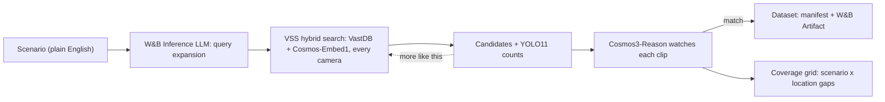

# Edge-Case Miner

Find the rare edge-case clips AV and robotics teams need for training: describe a scenario in plain English, search every camera in a VAST video archive, let NVIDIA Cosmos3-Reason watch each candidate, and export a verified, versioned dataset.

## The problem

Perception models fail on rare events: a pedestrian stepping out between parked cars, a worker brushing past a moving forklift, driving in snow. Those clips may exist somewhere in thousands of hours of multi-camera footage, but nobody can find them, semantic search returns plausible look-alikes (most top hits for a rare scenario don't actually show it), and nobody knows which edge cases the archive simply doesn't contain.

## How it works

1. **Describe** the edge case in plain English, or pick one of 10 taxonomy scenarios.
2. **Expand.** Qwen 3.8 on W&B Inference rewrites it as 4 caption-style search queries.
3. **Search.** The scenario and its queries run concurrently against VSS hybrid search (Cosmos-Embed1 text + visual vectors in VastDB) across every camera. Hits are merged (best similarity, which queries found them) and shown with their YOLO11 object counts.
4. **Verify.** Cosmos3-Reason *watches* each candidate: the app pulls the 5 s segment, shrinks it to 480p / 8 fps H.264 and asks for a strict JSON verdict `{match, confidence, why}`. If Cosmos is unavailable, DeepSeek V4 on W&B Inference judges the ingest caption instead (labelled "caption"). Verdicts are cached.
5. **Grow from good hits.** "More like this" searches with a clip's caption; before/after steps to the neighbouring segments of the same video.
6. **Coverage.** A scenario × location grid. Cells with no verified match are GAPs (red): the edge cases to go collect or simulate.
7. **Export.** The verified set becomes a manifest (S3 URI, timestamps, camera, location, label, verdict, reason) and a versioned W&B Artifact. Every step is traced in W&B Weave.



## Stack

- **VAST**: S3 (5 s segments), DataEngine (ingest pipeline), VastDB (hybrid text + visual vectors and metadata) behind the VSS retrieval API
- **NVIDIA Cosmos3-Reason**: captions at ingest, plus live clip verification in this app
- **NVIDIA Cosmos-Embed1**: hybrid search embeddings
- **YOLO11**: detections in the index, shown as evidence next to each verdict
- **W&B Inference**: Qwen 3.8 for query expansion, DeepSeek V4 for the caption-judge fallback
- **W&B Weave**: traces of expand / search / verify / mine / export
- **W&B Artifacts**: versioned dataset exports
- **FastAPI + vanilla JS** (Tailwind via CDN, no build step), deployed on Kubernetes from a ConfigMap (no image build), with a Cloudflare quick tunnel for a public HTTPS link; clips are relayed through the app, so the VSS token never reaches the browser

## Run it

Locally with the offline mock corpus (clearly labelled fake data, no network calls):

```bash
cd app && pip install -r requirements.txt && MOCK=1 python main.py    # http://localhost:8080
```

On the workshop VM against the live stack, everything goes through one script. It loads `/config/<team>.config`, fills in what the team config leaves out (the Cosmos3-Reason URL, a user-local `kubectl`), and never prints secrets:

```bash
bash vm/go.sh check    # preflight: login, index stats, search shape, a live Cosmos clip verdict, W&B, cluster access
bash vm/go.sh          # preflight + deploy to the team namespace, prints the URL
bash vm/go.sh local    # fallback: run on the VM itself (builds a venv with uv; the pool VMs have no pip)
bash vm/go.sh warm     # precompute the coverage grid and demo verdicts inside the pod
```

- **Deploy:** `bash deploy/deploy.sh` → `http://<team-host>/app` (python:3.12-slim + code ConfigMap + credentials Secret + Ingress; falls back to `/edge-case-miner` if another app in a shared namespace already owns `/app`; also starts a Cloudflare quick tunnel to the app's Service only and prints its public `https://…trycloudflare.com` link; `TUNNEL=0` skips it; honours `$KUBECTL` and `$KUBECONFIG`)
- **Precompute the demo:** `python main.py --warm`, or **Warm cache** in the Coverage tab, or inside the cluster: `kubectl -n <team> exec deploy/edge-case-miner -- python main.py --warm`
- **Tests:** `python tests/test_app.py`

| Variable | Purpose |
|---|---|
| `VSS_URL` (or `INGRESS_URL`), `VSS_USERNAME` (or `USERNAME`), `VSS_PASSWORD` (or `PASSWORD`) | VSS backend and login |
| `PUBLIC_VSS_URL` | base for browser playback URLs (default: `VSS_URL`) |
| `COSMOS3_REASON_URL`, `GPU_BEARER_TOKEN`, `COSMOS3_REASON_MODEL` | clip verification (model id auto-discovered) |
| `WANDB_API_KEY`, `WANDB_TEAM` (or `WANDB_ENTITY`), `WANDB_PROJECT`, `WANDB_INFERENCE_URL` | LLM, Weave, Artifacts |
| `LLM_EXPAND_MODEL`, `LLM_JUDGE_MODEL` (or `LLM_MODEL` for both) | pin W&B models; default: Qwen 3.8 / DeepSeek V4 from the live model list |
| `MOCK`, `CACHE_DIR`, `MAX_VERIFY`, `VERIFY_CONCURRENCY`, `PORT` | app behaviour |
| `INCLUDE_CAMERAS` | allowlist of cameras to serve (deploy.sh default: the organizers' corpus cameras, since a shared team index also holds other people's uploads) |
| `EXCLUDE_CAMERAS`, `EXCLUDE_LOCATIONS` | never search, show or relay these (deploy.sh default: the private neighborhood camera, since the app has a public link) |

Missing integrations degrade instead of failing: no Cosmos means caption judging, no W&B means template query expansion and a manifest-only export. Hybrid similarity on the live index runs low (a strong hit scores about 0.3), so searches default to `min_similarity` 0.12 and 30 candidates and let verification do the filtering; the coverage grid counts hits at 0.2 or above.

**API:** `GET /api/clip?source=` (video relay with Range) · `POST /api/mine` · `POST /api/verify` (≤ 8 sources) · `POST /api/similar` · `GET /api/coverage` · `POST|GET /api/warm` · `POST /api/export` + `GET /api/export/{id}.json` · `GET /api/config` · `GET /health`

## 2-minute demo

1. **0:00 Problem.** Rare events break perception models, they hide in hours of footage, and search returns look-alikes.
2. **0:15 Mine.** Click *Pedestrian steps into road*. Point at the queries the LLM wrote and at the hits from the Toronto dashcam, SF street cams and the neighbourhood cam: every camera in one search.
3. **0:45 Verify.** Watch the badges flip as Cosmos3-Reason checks each clip. The stats strip reads "N candidates → M verified matches, raw precision P%", which is the value of verification. Hover a match to play it, read its one-sentence reason, step to before/after.
4. **1:10 Grow.** *More like this* on the best match.
5. **1:25 Coverage.** Red cells are gaps: the edge cases this archive has no verified footage of (for example *Driving in rain or snow*: the PIE drives were all recorded in clear weather), which become the collection or simulation list. Click a cell to mine that scenario at that location.
6. **1:45 Ship.** Dataset → *Add all matches* → *Export*: manifest download plus the W&B Artifact, then show the Weave trace of the run.

## Layout

```
app/                  deployable app (flat: it becomes a ConfigMap)
  main.py             FastAPI routes, pipeline, coverage, warm-up, export, CLI
  vss.py              VSS client + response normalizer
  cosmos.py           clip shrinking, Cosmos3-Reason judge, verdict cache, verifier
  llm.py              W&B Inference client, JSON parsing, Weave + Artifacts
  mock.py             offline demo corpus
  index.html          single-page UI
  taxonomy.json       the 10 coverage scenarios
deploy/deploy.sh      Kubernetes deploy (run on the VM)
vm/go.sh              one command on the VM: update, preflight, deploy / local / warm
vm/env.sh             fills in what the team config leaves out (Cosmos URL, kubectl)
vm/preflight.py       stdlib-only checks of every service; prints no secrets
tests/test_app.py     normalizer, parsing and API smoke tests
tests/fake_stack.py   fake VSS + Cosmos3-Reason + W&B servers for offline end-to-end runs
```
